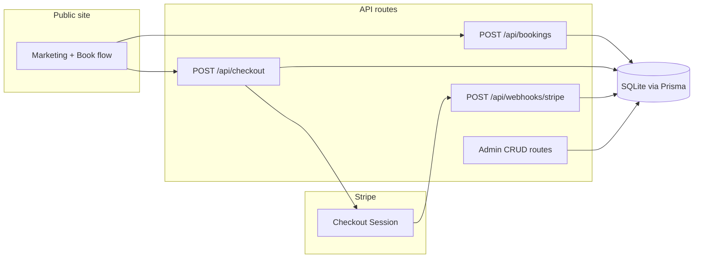

# Umie Creations — Full-Stack Booking Platform Plan

## Assumptions

- **Greenfield**: [`/Users/agrima/Documents/Umie Creations`](file:///Users/agrima/Documents/Umie%20Creations) is empty; the deliverable is a new Next.js project rooted there (or you confirm a subfolder like `web/`).
- **Image uploads (inspiration)**: MVP uses an API route that saves files under `public/uploads/inspiration/` with unique names and stores the public URL on `Booking.inspirationImageUrl`. Document swapping to Vercel Blob/S3/Cloudinary for production.
- **Admin auth**: Single shared password from `ADMIN_PASSWORD`; successful login sets an **httpOnly** cookie (e.g. HMAC-signed value with a server secret derived from `ADMIN_PASSWORD` + `NEXTAUTH_SECRET` or a dedicated `ADMIN_SESSION_SECRET`) validated in middleware on `/admin/*` except `/admin/login`. No `AdminUser` model for MVP.

## High-Level Architecture



**Booking → payment flow**

1. Client completes steps 1–5; on “Pay deposit” / “Pay full”, `POST /api/bookings` creates a row with `paymentStatus: pending_payment` (or `awaiting_payment`), `status: new` or `pending_payment`, and computed `amount` (deposit % or full from selected `ServicePackage`).
2. `POST /api/checkout` reads `bookingId`, creates Stripe Checkout Session (metadata: `bookingId`), updates `stripeSessionId`, redirects URL from session.
3. **Success page** (`/book/success`) can show a confirmation from `session_id` query param via `stripe.checkout.sessions.retrieve` (optional) or rely on webhook; **webhook** is the source of truth to set `paymentStatus: paid` and `status: confirmed` (or your chosen mapping).

**Custom quote**: Create booking with `packageType: custom` / flag from package `isCustomQuote`, `paymentOption: custom_quote`, `paymentStatus: not_required`, `amount: 0` (or null — Prisma: use `Decimal?` or `0`), `status: new`; no Stripe redirect.

## Tech Versions (suggested)

- Next.js 15 (App Router), React 19, TypeScript, Tailwind CSS v4 *or* v3 (use `create-next-app` default for stability).
- Prisma 6 + `better-sqlite3` or `@prisma/adapter-libsql` for SQLite.
- `zod` + `@hookform/resolvers` + `react-hook-form` for booking and admin forms.
- `stripe` Node SDK server-side only.

## Folder Structure (target)

```
/
  prisma/
    schema.prisma
    seed.ts
  public/
    uploads/inspiration/     (gitignore contents, keep .gitkeep)
    images/placeholders/     (documented placeholder assets)
  src/
    app/
      layout.tsx
      globals.css
      page.tsx                          # Home
      services/page.tsx
      gallery/page.tsx
      about/page.tsx
      contact/page.tsx
      christmas/page.tsx
      treats/page.tsx
      book/
        page.tsx                        # Multi-step client
        success/page.tsx
        cancel/page.tsx
      admin/
        login/page.tsx
        layout.tsx                      # Sidebar + auth check
        page.tsx                        # Dashboard overview
        bookings/page.tsx
        packages/page.tsx
        gallery/page.tsx
      api/
        bookings/route.ts
        bookings/[id]/route.ts
        checkout/route.ts
        webhooks/stripe/route.ts
        upload/inspiration/route.ts
        admin/login/route.ts
        admin/logout/route.ts
        admin/bookings/route.ts
        admin/packages/route.ts
        admin/packages/[id]/route.ts
        admin/gallery/route.ts
        admin/gallery/[id]/route.ts
        admin/stats/route.ts            # revenue + upcoming (optional aggregation)
    components/
      marketing/                        # Hero, ServiceCard, Section, Footer, Nav
      booking/                          # Stepper, steps, ReviewSummary
      admin/                            # DataTable, StatusBadge, StatCard, forms
      ui/                               # Button, Input, Card, Select (minimal)
    lib/
      prisma.ts
      stripe.ts
      auth/admin-session.ts             # sign/verify cookie
      constants/services.ts             # service type enums, labels
      validators/booking.ts             # zod schemas
    middleware.ts                       # Protect /admin/* (except login, api)
  .env.example
  package.json
```

Adjust `src/` vs root `app/` to match `create-next-app` choice (prefer `src/app` for clarity).

## Prisma Schema ([prisma/schema.prisma](prisma/schema.prisma))

- **`ServicePackage`**: `id`, `serviceType` (enum or string), `name`, `description`, `price` (`Decimal`), `depositPercent` (`Int`), `isCustomQuote` (`Boolean`), `isActive` (`Boolean`), timestamps.
- **`Booking`**: All specified fields; use enums where helpful:
  - `serviceType`, `packageType` (or string matching seed)
  - `paymentOption`: `deposit | full | custom_quote`
  - `paymentStatus`: e.g. `pending | paid | failed | not_required`
  - `status`: `new | pending_payment | paid | confirmed | completed | cancelled` (align filter list with user request: map “Pending Payment” ↔ `pending_payment`, “Paid” ↔ `paid`, etc.)
- **`GalleryItem`**: As specified; `category` aligns with service types or “general”.

Indexes: `Booking.eventDate`, `Booking.status`, `Booking.paymentStatus`, `ServicePackage.serviceType`.

## Seed Data ([prisma/seed.ts](prisma/seed.ts))

- Four service **types** × three tiers (**Basic**, **Premium**, **Luxury**) with realistic placeholder prices and `depositPercent` (e.g. 25–50%).
- One **Custom Quote** row per service type (`isCustomQuote: true`, `price: 0`).

## Stripe Implementation

- **[lib/stripe.ts](lib/stripe.ts)**: Instantiate `Stripe` with `STRIPE_SECRET_KEY`.
- **[app/api/checkout/route.ts](src/app/api/checkout/route.ts)**:
  - Validate `bookingId`, load booking + package.
  - `mode: 'payment'`, `line_items` with single price_data (amount in cents from booking `amount`) or use pre-created Stripe Prices later; MVP uses **dynamic price_data** from computed totals.
  - `success_url`: `${NEXT_PUBLIC_APP_URL}/book/success?session_id={CHECKOUT_SESSION_ID}`
  - `cancel_url`: `${NEXT_PUBLIC_APP_URL}/book/cancel`
  - Metadata: `bookingId`.
- **[app/api/webhooks/stripe/route.ts](src/app/api/webhooks/stripe/route.ts)**:
  - `stripe.webhooks.constructEvent` with `STRIPE_WEBHOOK_SECRET`.
  - On `checkout.session.completed`, load metadata `bookingId`, set `paymentStatus: paid`, `status: confirmed` (or `paid` then admin confirms — your product choice; plan: auto-**confirmed** on successful payment for MVP).

**Local webhook testing**: Document `stripe listen --forward-to localhost:3000/api/webhooks/stripe` in setup instructions.

## Booking UI ([app/book/page.tsx](src/app/book/page.tsx))

- **5 steps** as specified; state in React (`useState` or URL searchParams per step for shareability — optional; `useState` is fine for MVP).
- Step 3: date/time picker (native or lightweight), address, budget range (select), notes, **optional** file input → `POST /api/upload/inspiration` then store URL in form state.
- Step 5: summary + radio: Deposit / Full / (Custom Quote path disables payment).
- Submit handlers:
  - **Payment path**: create booking via API → receive `bookingId` → call checkout API → `redirect` to `session.url`.
  - **Custom quote**: create booking only → toast/success message → redirect to `/book/success?quote=1` or dedicated message.

## Marketing Pages

- Shared **layout**: sticky nav, footer, cream background, serif headings (e.g. `font-serif` via `next/font` — **Fraunces** or **Cormorant Garamond**), body **DM Sans** or **Inter**).
- **Home**: hero CTA “Create a Beautiful Moment”, services preview, featured gallery (latest `GalleryItem` or static placeholders until DB wired), “Why choose”, testimonials placeholder grid, final CTA “Book Your Date” → `/book`.
- **Services**: 4 cards + package pricing Grid fed from `ServicePackage` (server component + `prisma` fetch `isActive`).
- **Gallery**: Masonry or CSS grid from `GalleryItem`.
- **About**, **Contact**: editorial layout; contact can mirror booking CTA.
- **Christmas**, **Treats**: seasonal/vertical landing pages linking to filtered booking preselection (`/book?service=christmas` query) — optional but improves UX.

**Placeholders**: Use **unsplash.com**-style documented URLs or local `/public/images/placeholders/` with **royalty-free** images only; README note to replace with real brand photography.

## Admin Dashboard

- **`/admin/login`**: Form posts to `/api/admin/login`; sets cookie.
- **`middleware.ts`**: Allow `/admin/login`, `/api/admin/login`; block other `/admin` without valid cookie.
- **Dashboard home**: Cards — counts by status, **revenue** (sum `amount` where `paymentStatus = paid`), **upcoming** (table: next 10 by `eventDate` ≥ today).
- **Bookings table**: Columns per spec; filters (client-side or query `?status=`); inline or drawer **status** update → `PATCH /api/admin/bookings/[id]`.
- **Packages**: Table + modal/page for add/edit/delete; map to Prisma CRUD.
- **Gallery**: Table + image URL (and optional upload same as inspiration or URL-only for MVP simplicity **URL-only** in admin is fastest; optional file upload later).

**Desktop-first** responsive tables (horizontal scroll on small screens).

## Environment & Setup

- **[.env.example](.env.example)** exactly as specified variables.
- **README** (if you want local instructions without violating “no extra markdown” preference from user rules — user explicitly asked for “Local setup instructions” in OUTPUT, so include **brief** setup in README or SETUP.md per user request).
- Commands:
  - `npm install`
  - `npx prisma migrate dev`
  - `npx prisma db seed`
  - `npm run dev`

## Security & Production Notes (comments in code)

- Never expose `STRIPE_SECRET_KEY` to client.
- Validate all admin and checkout inputs with Zod.
- Rate-limit admin login in a follow-up if needed; MVP acceptable with strong password.
- CORS: N/A for same-origin API routes.

## Implementation Order

1. `create-next-app` + Tailwind + TS + ESLint; add Prisma, schema, migrate, seed.
2. `lib/prisma`, `lib/stripe`, design tokens in `globals.css`.
3. Marketing shell (layout, nav, footer) + all 7 pages (placeholder content first).
4. Public gallery + services reading DB.
5. Booking flow + upload route + booking API.
6. Stripe checkout + success/cancel + webhook.
7. Admin session + middleware + dashboard sections + CRUD APIs.
8. Polish: status badges, hover states, accessibility basics, `.env.example`, setup docs.

## Deliverable Checklist (maps to your requested output)

| Item | Where |
|------|--------|
| Project structure | As above |
| Prisma schema + seed | `prisma/` |
| API routes | `src/app/api/**` |
| Stripe Checkout + webhook | `checkout/route.ts`, `webhooks/stripe/route.ts` |
| Booking components | `src/components/booking/**` |
| Admin pages/components | `src/app/admin/**`, `src/components/admin/**` |
| Tailwind styling | `globals.css` + component classes |
| `.env.example` | repo root |
